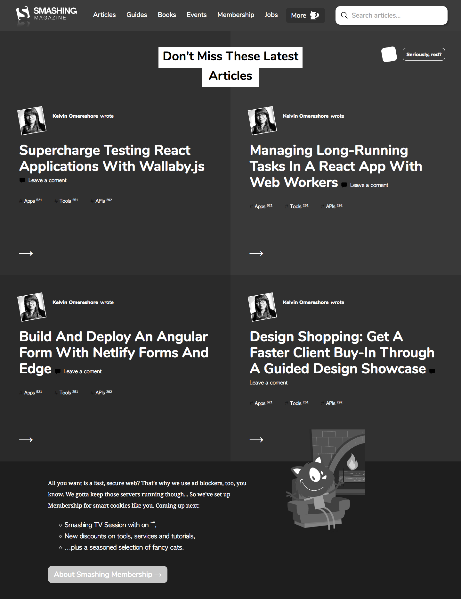

# Design Teardown Page (Heatmap of Smashing Magazine Website)

> This is a project that's meant to be a teardown of the visual hierarchy of [Smashing Magezine's Website](https://www.smashingmagazine.com/).

In this project we applied visual hierarchy principles to to create a heatmap of Smashing Magazine's website. The requirements were to use grayscale to show the hierarchy of the elements and clone the main layout of the page.

We used CSS Grid, Flexbox and Floats to build the layout.

## Built With

- HTML
- CSS

## Live Demo

[Live Demo](https://starsheriff2.github.io/Design-Teardown-heatmap/)

## Authors

👤 **Arturo Alvarez**

- GitHub: [@StarSheriff2](https://github.com/StarSheriff2)
- Twitter: [@Turo_83](https://twitter.com/Turo_83)
- LinkedIn: [Carlos Alvarez](https://www.linkedin.com/in/carlosalvarezveroy/)

👤 **Alejandro Contreras**

- GitHub: [@bAlejandroNo4](https://github.com/AlejandroNo4)
- Twitter: [@Alejand80002666](https://twitter.com/Alejand80002666)
- LinkedIn: [Alejandro Contreras](https://www.linkedin.com/in/alejandro-contreras-rodriguez-b524821b5/)

## Contributing

Contributions, issues, and feature requests are welcome!

Feel free to check the [issues page](inser issues page address here).

## Show your support

Give a ⭐️ if you like this project!
